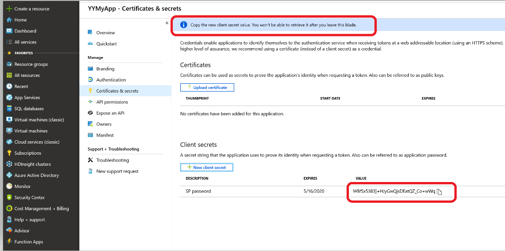

# AI DevOps Workshop / Lab Pre-requisites

### Introduction

The AI DevOps workshop will walk you through how to build a Continuous Integration and Continuous Delivery (CI/CD) pipeline for a machine learning model. The two Azure services that will be used to construct the solution are _Azure DevOps_ and _Azure Machine Learning_. The solution can be adapted for other popular build systems like Jenkins and Travis.

### Prerequisites

To complete the labs for the AI DevOps workshop you will need the following:

- An active Azure subscription ([start free](https://azure.microsoft.com/en-us/free/)).
- To provision a service principal
- Assign RBAC permissions to the service principal (contributor role)
- Confirm you have at least contributor level permissions within the azure subscription
- Access to an Azure DevOps account. We will be running our build, retraining, and release pipelines using Azure DevOps. To verify you have an existing account, navigate to [http://devops.azure.com](http://devops.azure.com) and verify. If you don&#39;t already have a DevOps account, create one by following the instructions 

The instructions below walk through the steps for these pre-requisites. Azure documentation references for these steps are also available:

- [How to: Use the portal to create an Azure AD application and service principal that can access resources](https://docs.microsoft.com/en-us/azure/active-directory/develop/howto-create-service-principal-portal)

### Provision a Service Principal

A service principal will be used by Azure DevOps to execute the pipelines and deploy resources into your Azure subscription. A service principal is generated when you create an Azure Active Directory application (sometimes the two are referred to interchangeably). To create an Azure AD application, you will need to have at least &#39;contributor&#39; level role within the azure subscription.

As you work through this section, be sure to note down the following values because you will need them during the workshop when you configure and connect your Azure DevOps pipelines to your Azure subscription:

| Subscription ID | This is your azure subscription id |
| --- | --- |
| Application name. AKA Service principal (SP) | This will be the displayed name for the application you create and register. |
| Application (client ID) | When you register your application name, this will be generated (a GUID) |
| Object ID | When you register your application name, this will be generated (a GUID) |
| Directory (tenant) ID | This is also a GUID and is displayed when you register an application |
| Service principal password | When you create a secret for your registered application (SP), it will generate a GUID as a password. Be sure to copy and note the password because it will only be displayed when the secret is created.   |

To provision a Service principal, create an Azure Active Directory application:

1. Navigate to the portal: [https://portal.azure.com/](https://portal.azure.com/)
2. Select Azure Active Directory -&gt; App registrations -&gt; New application registration

 
 

3. Fill in a name for the service principal/app name and click &#39;Register&#39; at the bottom of the page to create your app registration/service principal:

 
 
4. The application will be created and a screen will return looking similar to the screen shot below. Copy and save this information to use during the lab:
  - Display name
  - Application (client) ID
  - Directory (tenant) ID
  - Object ID

 
     

5. Once you have copied and saved these values, create a password for the service principal.
  a. Select **Certificates &amp; secrets**.
  b. Select **Client secrets -\&gt; New client secret**.
  c. Provide a description of the secret, and a duration. When done, select **Add**.

After saving the client secret, the value of the client secret is displayed. Copy this value because you will not be able to retrieve the key later. You provide the key value with the application ID to sign in as the application. Store the key value where your application can retrieve it.

 
     

6. **Reminder: When you click Add, the key will appear only once so make sure you copy it somewhere safe for later use**.

 

     
### Assign RBAC permissions to Service Principal (Contributor role)

Now that the service principal is created, the correct permissions need to be added to it so it can run the Azure DevOps pipelines. The service principal needs to be provided the &#39;contributor&#39; role to the azure subscription that will be used for the lab. An administrator for the Azure subscription would be the one to perform this function. The steps follow:

1. Navigate to the azure portal ([http://portal.azure.com](http://portal.azure.com))
2. Select All services -\&gt; Subscriptions. You will be presented with a list of azure subscriptions. Select the subscription that will be used for this lab.

3. Select Access control (IAM) and under Check access, do a search for your service principal name. Once it appears, select Add a role assignment. Note: If the Add box is greyed out, then you do not have sufficient permissions to add a role assignment to the service principal. An administrator for the subscription will need to help and complete the steps to add your service principal to the subscription contributor role.

 

4. Once the service principal has been granted the contributor role, it will be confirmed on the screen:

### Confirm your permissions level within the Azure subscription

To complete the lab, you will need at least &#39;contributor&#39; level access to the Azure subscription. To view your access:

1. From the azure portal ([http://portal.azure.com](http://portal.azure.com)), select subscriptions in the navigation bar and click on the subscription you will be using for this lab
2. Select Access control (IAM) from the left menu
3. Under the &#39;check access&#39; tab, search for your name and when it displays, review the role assigned to you. It should look similar to this:

###

